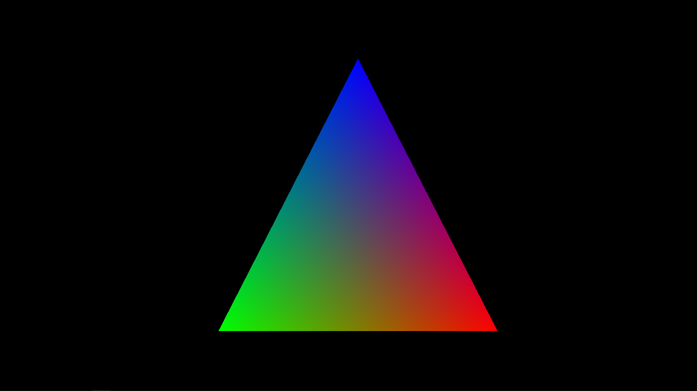
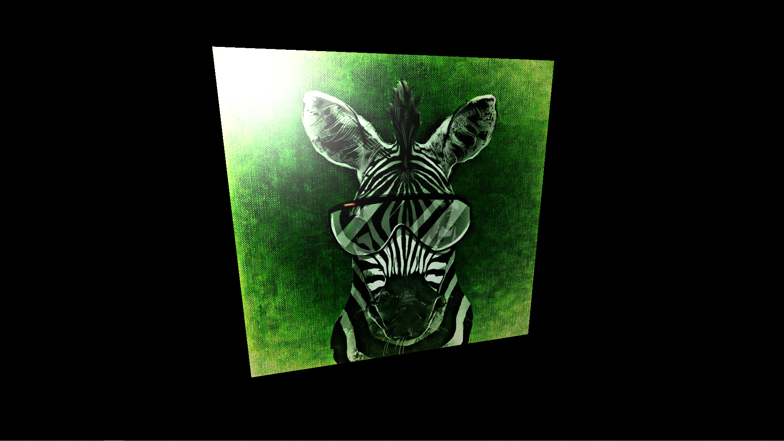
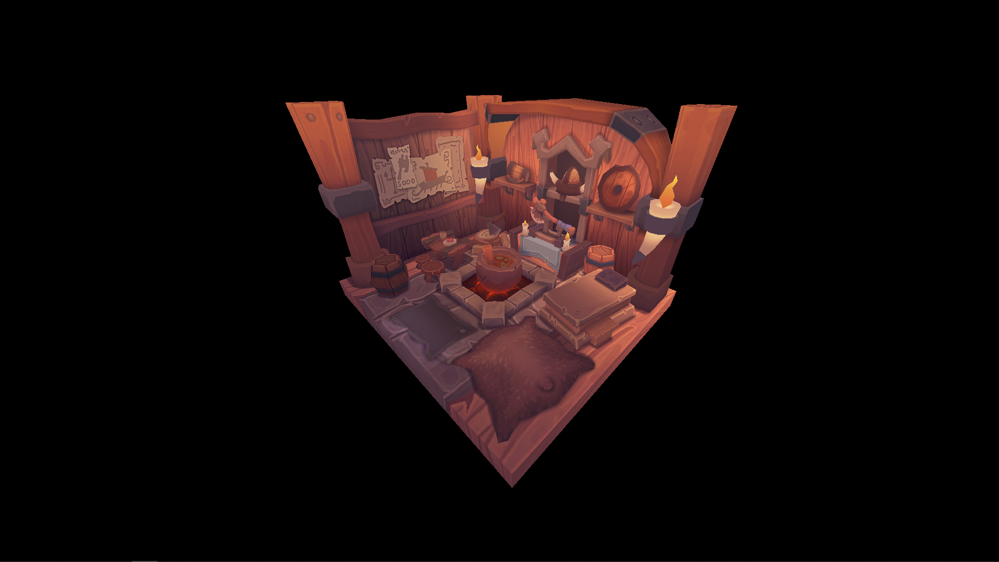
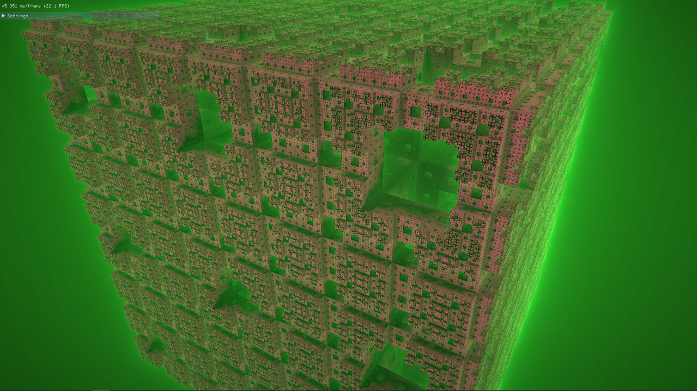
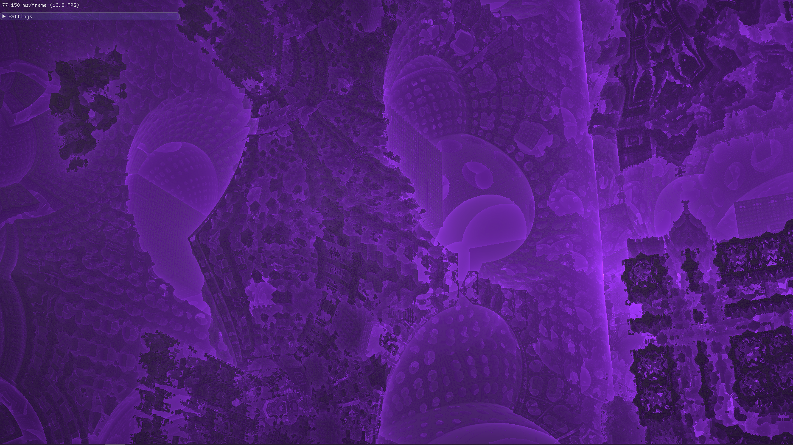
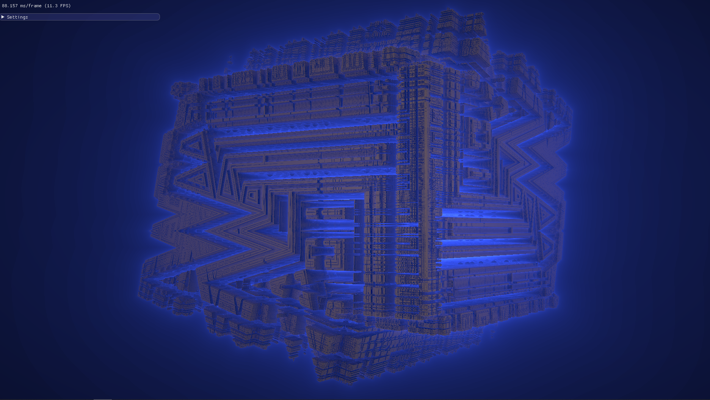
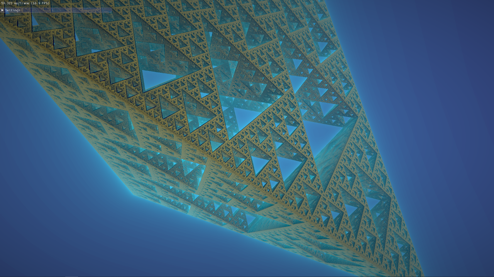
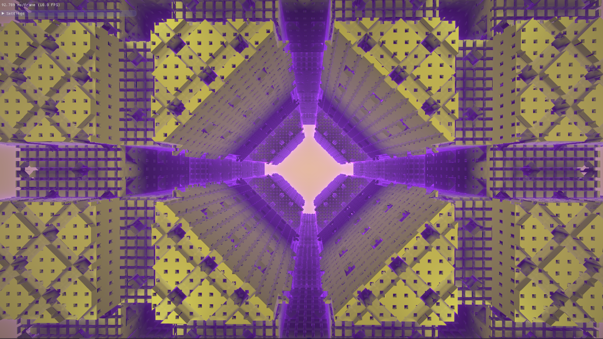
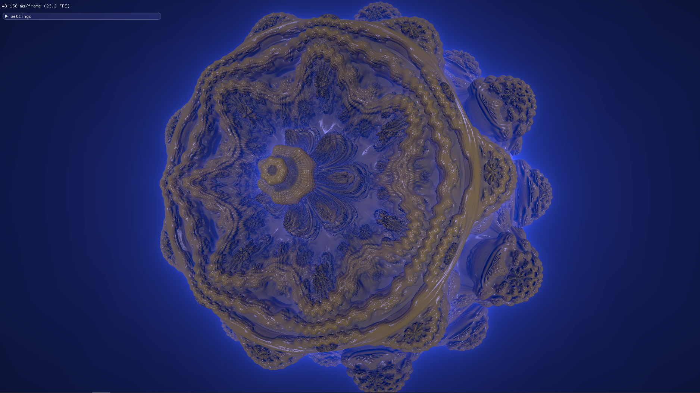

# Logi - Object-oriented Vulkan abstraction framework

Logi is light-weight Vulkan abstraction framework, which attempts to bridge the gap between previous graphics APIs and Vulkan by making API easier to use while still preserving Vulkan semantics and introducing as little overhead as possible.

## Features

* Supports core Vulkan 1.2 and Nvidia RTX extension (Khronos ray tracing specification not implemeted!)
* Object-oriented Vulkan abstraction framework
* Correctly enforced construction and destruction order of Vulkan resources
* Integration of the dynamic dispatching of Vulkan functions
* Vulkan configuration structures that use standard library (STL) containers
* Shader reflection functionality (SPIR-V Cross)
* Simplified management of memory allocations and memory bindings (Vulkan Memory Allocator)

## Requirements
Requirements for Logi framework:
* [Vulkan SDK 1.2](https://vulkan.lunarg.com/) (Tested up to version 1.2.154.1)
* [SPIRV-Cross](https://github.com/KhronosGroup/SPIRV-Cross)
* [Vulkan Memory Allocator](https://github.com/GPUOpen-LibrariesAndSDKs/VulkanMemoryAllocator)
  
Requirements for running examples:
* [GLFW](https://www.glfw.org/)
* [glm](https://github.com/g-truc/glm)

When cloning repository clone recursively:  
```
git clone --recursive https://github.com/UL-FRI-LGM/Logi.git
```


## Building
Logi has been tested on Windows and Linux. Use the provided CMakeLists.txt with [CMake](https://cmake.org) to generate a build configuration for your favorite IDE or compiler.


## Documentation
Generate documentation with [CMake](https://cmake.org) by running `doc_doxygen` target.  
```
cmake --build <dir> --target doc_doxygen 
```

For more detailed description of framework, please see [Primož Lavrič master thesis](https://repozitorij.uni-lj.si/Dokument.php?id=123261&lang=slv) or paper [Vulkan Abstraction Layer for Large Data Remote Rendering System](http://lgm.fri.uni-lj.si/wp-content/uploads/2018/07/1537841091.pdf).  


## Examples

### [1 - Base](examples/base/)
Implements Vulkan state holder, utility functions, Dear ImGui layer and base structure for examples.

### [2 - Hello triangle](examples/hello_triangle/)
Basic example of rendering colored triangle to screen with Logi framework.  

 

### [3 - Texture](examples/texture/)
Loading 2D texture from disk and rendering it to quad.    

 

### [4 - Vulkan tutorial port](examples/vulkanTutorialPort/)
Port of [Vulkan tutorial](https://vulkan-tutorial.com/) to Logi framework. Note, that mipmapping and multisampling are not implemented.    

 

### [5 - Fractals](examples/fractals/)
Visualisation of common 3D fractals. Also Dear ImGUI is used for setting window.   

   
  
  
  
  
   

### [6 - Path tracing](https://github.com/PrimozLavric/LogiPathTracer)
Nvidia RTX and rasterization implementation of path tracing.
